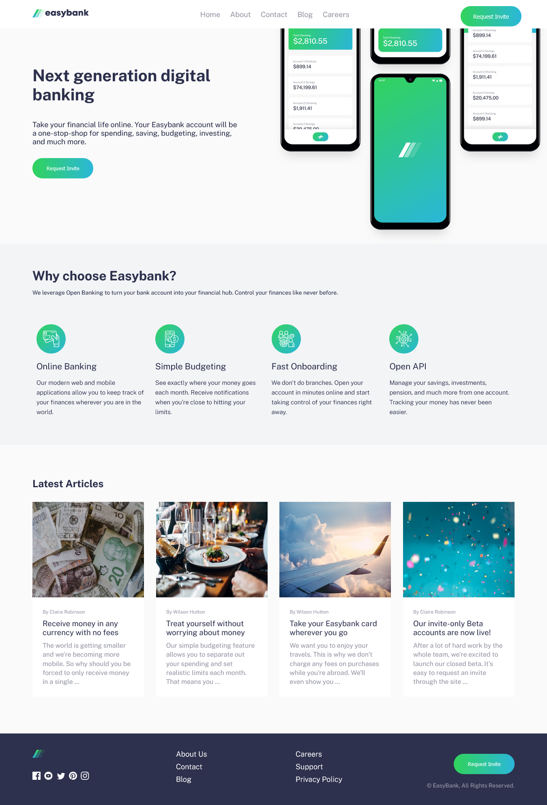

# Frontend Mentor - Easybank landing page solution

This is a solution to the [Easybank landing page challenge on Frontend Mentor](https://www.frontendmentor.io/challenges/easybank-landing-page-WaUhkoDN). Frontend Mentor challenges help you improve your coding skills by building realistic projects.

### Screenshot

### Links

- Solution URL: [Check solution](https://www.frontendmentor.io/challenges/easybank-landing-page-WaUhkoDN/hub/easybank-landing-page-jpka8dFCNP)
- Live Site URL: [Visit live site](https://easybanktheface.vercel.app)

### Built with

- Semantic HTML5 markup
- CSS custom properties
- JavaScript

## Author

- Portfolio - [Ezekiel The Face](https://thefacecodes.web.app)
- Frontend Mentor - [@thefacecodes](https://www.frontendmentor.io/profile/thefacecodes)
- Twitter - [@thefacecodes](https://www.twitter.com/thefacecodes)
